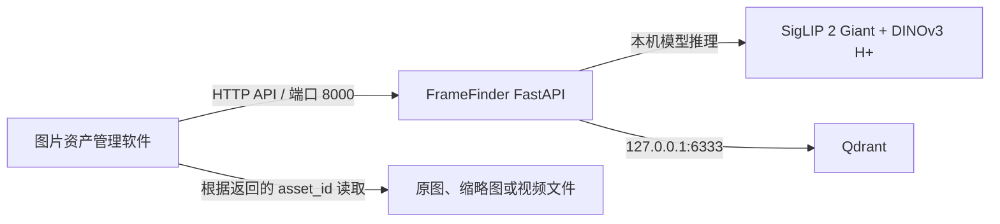

# FrameFinder 局域网图片资产管理系统对接文档

版本：1.0  
适用服务：FrameFinder Giant/H+ 本地检索服务  
当前模型：SigLIP 2 Giant 1B + DINOv3 ViT-H+/16 + pHash  
当前向量集合：`framefinder_assets_v3`

## 1. 文档目的

本文面向需要接入 FrameFinder 的图片资产管理软件开发者，说明：

1. 当前已有接口的调用方法和限制。
2. 局域网访问前需要完成的网络配置。
3. 正式接入资产库时建议实现的接口契约。
4. 图片、视频帧、元数据、删除和增量更新的同步方式。

## 2. 当前系统能力

| 能力 | 当前实现 |
| --- | --- |
| 文字搜图 | SigLIP 2 Giant，1536 维语义向量 |
| 以图搜图 | SigLIP 语义分数 + DINOv3 H+ 视觉分数 |
| 重复图片判断 | 64-bit pHash 汉明距离 |
| 向量数据库 | Qdrant，Cosine 距离 |
| 视觉向量 | DINOv3 H+，1280 维 |
| 图片缓存键 | 原始文件字节的 SHA-256 |
| 推理精度 | BF16 |
| 原始图片存储 | 不存储，只保存向量、pHash 和元数据 |

同一文件内容第二次出现时会直接读取 Qdrant 中的图片向量，不再运行图片编码器。文件改名不会影响命中；重新压缩、裁剪或改变文件内容会产生新的 SHA-256，需要重新编码。

## 3. 部署关系



建议只向局域网开放 FrameFinder API 端口 `8000`。Qdrant 的 `6333/6334` 端口应继续绑定 `127.0.0.1`，不要直接暴露给资产管理软件。

## 4. 局域网访问准备

### 4.1 当前局域网地址

FrameFinder 主机当前 WLAN 地址：

```text
IPv4：192.168.5.108
子网掩码：255.255.255.0
默认网关：192.168.5.114
```

可用链接：

| 用途 | 链接 |
| --- | --- |
| 网页界面 | `http://192.168.5.108:3417` |
| API 根地址 | `http://192.168.5.108:8000` |
| 健康检查 | `http://192.168.5.108:8000/api/health` |
| Swagger 接口文档 | `http://192.168.5.108:8000/docs` |
| OpenAPI JSON | `http://192.168.5.108:8000/openapi.json` |

后端当前监听 `0.0.0.0:8000`，网页当前监听 `0.0.0.0:3417`。同一局域网中的设备可以直接在浏览器打开网页界面，资产管理软件后端应使用 API 根地址。

本机 IP 由路由器分配，未来可能变化。`start_ui.cmd` 每次启动时会自动检测当前局域网 IPv4，并打开最新地址。长期对接建议在路由器中为本机配置 DHCP 地址保留。

### 4.2 Windows 防火墙

如防火墙阻止访问，可在管理员 PowerShell 中创建仅允许本地子网访问的规则：

```powershell
New-NetFirewallRule `
  -DisplayName "FrameFinder API 8000 LAN" `
  -Direction Inbound `
  -Protocol TCP `
  -LocalPort 8000 `
  -RemoteAddress LocalSubnet `
  -Action Allow
```

不要创建面向公网的端口转发。

### 4.3 CORS

如果资产管理软件通过自己的后端调用 FrameFinder，不受浏览器 CORS 限制。

如果资产管理软件是网页，并由浏览器直接调用 FrameFinder，需要把该网页的 Origin 加入 `server.py` 的 `allow_origins`，例如：

```text
http://192.168.1.50:8080
```

### 4.4 鉴权建议

当前测试接口没有鉴权，不应直接暴露到不可信网络。正式接入建议：

- 请求头使用 `X-FrameFinder-Key`。
- API 密钥通过环境变量读取，不写进代码仓库。
- 资产管理软件的后端统一转发请求，避免在浏览器中暴露密钥。
- 如网络中包含不可信设备，使用 Nginx、Caddy 或现有网关提供 HTTPS。

## 5. 当前可用接口

> 当前接口适合联调和“小批候选图片排序”。它还不是完整的全库检索 API：搜索时仍需上传本次候选图片，结果只在这些上传图片中排序。

### 5.1 健康检查

```http
GET /api/health
```

示例响应：

```json
{
  "ok": true,
  "loaded": true,
  "device": "NVIDIA GeForce RTX 4090 D",
  "semantic_model": "SigLIP 2 Giant 1B Patch16 384",
  "visual_model": "DINOv3 ViT-H+/16",
  "database": {
    "online": true,
    "collection": "framefinder_assets_v3",
    "stored_points": 1200
  }
}
```

判断服务可用应同时满足：

```text
ok == true
database.online == true
```

### 5.2 文字搜图

```http
POST /api/search
Content-Type: multipart/form-data
```

字段：

| 字段 | 类型 | 必填 | 说明 |
| --- | --- | --- | --- |
| `files` | File[] | 是 | 1～200 张候选图片，可重复提交该字段 |
| `mode` | String | 是 | 固定为 `text` |
| `text` | String | 是 | 中文或英文搜索描述 |
| `query_index` | Integer | 否 | 文字模式忽略 |
| `semantic_weight` | Float | 否 | 文字模式忽略 |
| `visual_weight` | Float | 否 | 文字模式忽略 |

Windows cURL 示例：

```powershell
curl.exe -X POST "http://192.168.5.108:8000/api/search" `
  -F "files=@D:\assets\001.jpg" `
  -F "files=@D:\assets\002.jpg" `
  -F "mode=text" `
  -F "text=城市夜景中的人物特写"
```

### 5.3 以图搜图

```http
POST /api/search
Content-Type: multipart/form-data
```

字段：

| 字段 | 类型 | 必填 | 说明 |
| --- | --- | --- | --- |
| `files` | File[] | 是 | 1～200 张图片，参考图必须包含在内 |
| `mode` | String | 是 | 固定为 `image` |
| `query_index` | Integer | 是 | 参考图在 `files` 中的零基下标 |
| `semantic_weight` | Float | 否 | 默认 `0.58` |
| `visual_weight` | Float | 否 | 默认 `0.42` |

```powershell
curl.exe -X POST "http://192.168.5.108:8000/api/search" `
  -F "files=@D:\assets\reference.jpg" `
  -F "files=@D:\assets\candidate-01.jpg" `
  -F "files=@D:\assets\candidate-02.jpg" `
  -F "mode=image" `
  -F "query_index=0" `
  -F "semantic_weight=0.58" `
  -F "visual_weight=0.42"
```

权重会自动归一化。内容相似优先时提高 `semantic_weight`，构图、姿态和镜头相似优先时提高 `visual_weight`。

### 5.4 当前搜索响应

```json
{
  "mode": "image",
  "count": 3,
  "query_index": 0,
  "inference_ms": 42,
  "cache_hits": 3,
  "cache_misses": 0,
  "stored_points": 1200,
  "results": [
    {
      "index": 0,
      "rank": 1,
      "filename": "reference.jpg",
      "score": 1.0,
      "semantic_score": 1.0,
      "visual_score": 1.0,
      "phash_distance": 0,
      "width": 1920,
      "height": 1080,
      "cache_hit": true
    }
  ]
}
```

字段解释：

| 字段 | 说明 |
| --- | --- |
| `score` | 当前模式的最终排序分数，不应当作概率 |
| `semantic_score` | SigLIP Cosine 相似度 |
| `visual_score` | DINOv3 Cosine 相似度，文字模式为 `null` |
| `phash_distance` | pHash 汉明距离，越小越接近，`0` 表示指纹相同 |
| `cache_hit` | 本次图片向量是否直接从 Qdrant 读取 |
| `inference_ms` | 服务端本次处理耗时，包含必要的模型加载或编码 |

## 6. 当前接口的对接限制

资产管理软件正式接入前，应了解以下限制：

1. 当前 Qdrant Point ID 由图片内容 SHA-256 生成，没有保存资产软件的稳定 `asset_id`。
2. 当前接口只对本次上传的图片排序，不能直接在 Qdrant 全库中返回结果。
3. 当前没有单独的新增、更新、删除、查询状态接口。
4. 当前没有元数据过滤接口，例如目录、标签、媒体类型、日期和项目过滤。
5. 当前没有 API 密钥、并发限流和任务队列。
6. 当前不保存原始图片，因此搜索结果应由资产软件根据自己的 ID 返回缩略图和原文件。

因此，现有接口可以用于验证模型效果，但生产对接建议实现下一节的正式 API。

## 7. 建议新增的正式 API

> 本节是推荐接口契约，当前尚未实现。

所有正式接口建议使用版本前缀：

```text
/api/v1
```

所有请求建议携带：

```http
X-FrameFinder-Key: <API_KEY>
```

### 7.1 新增或更新资产

```http
POST /api/v1/assets/upsert
Content-Type: multipart/form-data
```

字段：

| 字段 | 类型 | 必填 | 说明 |
| --- | --- | --- | --- |
| `asset_id` | String | 是 | 资产系统中的稳定唯一 ID |
| `file` | File | 是 | 图片或视频关键帧 |
| `metadata` | JSON String | 否 | 文件夹、标签、时间戳等信息 |
| `force` | Boolean | 否 | 是否强制重新生成向量 |

`metadata` 示例：

```json
{
  "media_type": "image",
  "folder_id": "folder-2026-001",
  "source_path": "\\\\NAS01\\assets\\2026\\A001.jpg",
  "thumbnail_url": "/api/assets/A001/thumbnail",
  "tags": ["人物", "夜景"],
  "project_id": "project-17",
  "updated_at": "2026-07-14T16:30:00+08:00"
}
```

建议响应：

```json
{
  "asset_id": "A001",
  "status": "created",
  "content_hash": "sha256:...",
  "vectors": {
    "semantic": 1536,
    "visual": 1280
  },
  "phash": "f0c0...",
  "indexed_at": "2026-07-14T16:30:06+08:00"
}
```

`status` 建议值：

- `created`：新资产已生成向量。
- `updated`：相同 `asset_id` 的文件内容发生变化。
- `reused`：文件内容未变化，复用已有向量。
- `metadata_only`：仅元数据变化，不需要重新编码。

### 7.2 查询资产索引状态

```http
GET /api/v1/assets/{asset_id}
```

建议响应：

```json
{
  "asset_id": "A001",
  "indexed": true,
  "content_hash": "sha256:...",
  "model_version": "giant-hplus-v3",
  "indexed_at": "2026-07-14T16:30:06+08:00"
}
```

### 7.3 删除资产索引

```http
DELETE /api/v1/assets/{asset_id}
```

删除资产软件中的文件时，应同步删除对应 Qdrant Point。该操作只删除向量和元数据，不处理原始文件。

建议响应：

```json
{
  "asset_id": "A001",
  "deleted": true
}
```

### 7.4 更新元数据

文件重命名、移动目录或修改标签时，不应重新生成向量：

```http
PATCH /api/v1/assets/{asset_id}/metadata
Content-Type: application/json
```

```json
{
  "source_path": "\\\\NAS01\\assets\\archive\\A001.jpg",
  "folder_id": "archive",
  "tags": ["人物", "夜景", "精选"]
}
```

### 7.5 全库文字搜索

```http
POST /api/v1/search/text
Content-Type: application/json
```

```json
{
  "query": "紫色灯光下的人物特写",
  "top_k": 50,
  "filters": {
    "media_type": ["image", "video_frame"],
    "project_id": "project-17",
    "tags_any": ["精选", "人物"]
  }
}
```

服务端只需要运行 SigLIP 文本编码器，然后直接搜索 Qdrant 的 `semantic` 向量。

### 7.6 使用已有资产进行以图搜图

```http
POST /api/v1/search/by-asset
Content-Type: application/json
```

```json
{
  "asset_id": "A001",
  "top_k": 50,
  "semantic_weight": 0.55,
  "visual_weight": 0.45,
  "exclude_self": true,
  "filters": {
    "project_id": "project-17"
  }
}
```

参考图已经入库时，不需要再次上传图片或运行图片编码器。

### 7.7 使用临时上传图片进行以图搜图

```http
POST /api/v1/search/by-upload
Content-Type: multipart/form-data
```

字段：

| 字段 | 类型 | 必填 |
| --- | --- | --- |
| `file` | File | 是 |
| `top_k` | Integer | 否，默认 50 |
| `semantic_weight` | Float | 否，默认 0.55 |
| `visual_weight` | Float | 否，默认 0.45 |
| `filters` | JSON String | 否 |

临时参考图可以只在内存中生成向量，不必写入资产库。

### 7.8 建议的统一搜索响应

```json
{
  "query_type": "image_asset",
  "count": 2,
  "elapsed_ms": 18,
  "hits": [
    {
      "asset_id": "A108",
      "score": 0.8731,
      "semantic_score": 0.8214,
      "visual_score": 0.9363,
      "phash_distance": 7,
      "metadata": {
        "media_type": "image",
        "thumbnail_url": "/api/assets/A108/thumbnail",
        "source_path": "\\\\NAS01\\assets\\A108.jpg"
      }
    }
  ]
}
```

FrameFinder 不应返回原始图片二进制；资产软件根据 `asset_id` 或 `thumbnail_url` 展示自己的素材。

## 8. Point ID 与去重设计

正式接入时，不建议继续只使用内容哈希作为资产 ID。推荐：

```text
Qdrant Point ID = UUIDv5(namespace, external_asset_id)
payload.asset_id = 资产软件稳定ID
payload.content_hash = 文件SHA-256
```

规则：

- 相同 `asset_id`、相同哈希：幂等返回，不重新编码。
- 相同 `asset_id`、不同哈希：重新编码并更新 Point。
- 不同 `asset_id`、相同哈希：可复用计算结果，但分别保留资产映射。
- 仅路径、标签或文件名变化：只更新 payload。

推荐 payload：

```json
{
  "asset_id": "A001",
  "content_hash": "...",
  "phash": "...",
  "media_type": "image",
  "source_path": "...",
  "video_id": null,
  "timestamp": null,
  "width": 1920,
  "height": 1080,
  "folder_id": "...",
  "project_id": "...",
  "tags": [],
  "model_version": "giant-hplus-v3",
  "updated_at": "..."
}
```

## 9. 首次导入与增量同步

### 9.1 首次全量导入

1. 资产软件扫描数据库中的图片和视频关键帧。
2. 优先发送 512 像素缩略图；不要只使用 256 像素缩略图。
3. 每个资产携带稳定 `asset_id` 和元数据。
4. 建议从并发 1～2 开始，根据显存和延迟逐步提高。
5. 记录成功、失败和重试状态，支持断点续传。
6. 导入完成后比较资产总数与 Qdrant Point 数量。

当前 Giant/H+ 组合的首次编码明显重于缓存搜索，不建议让用户界面同步等待大批量导入。正式版本应使用后台任务队列。

### 9.2 增量同步事件

| 资产软件事件 | FrameFinder 操作 |
| --- | --- |
| 新增文件 | `assets/upsert` |
| 文件内容修改 | `assets/upsert`，重新生成向量 |
| 重命名或移动 | 只更新 metadata |
| 标签变化 | 只更新 metadata |
| 删除文件 | `DELETE assets/{asset_id}` |
| 模型版本升级 | 新建集合并后台重新编码 |

## 10. 视频帧接入

视频不要只保存一条整片向量。建议每个镜头提取 1～3 个关键帧，并为每帧分配稳定 ID：

```text
video:{video_id}:frame:{timestamp_ms}
```

示例元数据：

```json
{
  "asset_id": "video:V1008:frame:125640",
  "media_type": "video_frame",
  "video_id": "V1008",
  "timestamp": 125.64,
  "source_path": "\\\\NAS01\\videos\\V1008.mp4"
}
```

搜索命中后，资产软件根据 `video_id + timestamp` 跳转到原视频位置。

## 11. 错误码与重试建议

| HTTP 状态码 | 建议含义 | 客户端处理 |
| --- | --- | --- |
| 400 | 参数或图片格式错误 | 不重试，修正请求 |
| 401/403 | API 密钥错误 | 停止请求并告警 |
| 404 | 资产 ID 不存在 | 检查同步状态 |
| 409 | ID 或版本冲突 | 获取状态后决定覆盖 |
| 413 | 文件或批次过大 | 降低批次或缩略图尺寸 |
| 422 | 字段校验失败 | 修正字段 |
| 429 | 并发过高 | 指数退避重试 |
| 503 | 模型或 Qdrant 暂不可用 | 指数退避重试 |

建议重试间隔：1 秒、2 秒、4 秒、8 秒，最多 4 次。新增和更新接口必须保持幂等。

## 12. 验收清单

- [ ] 资产软件所在设备可以访问 `GET /api/health`。
- [ ] Qdrant 端口没有暴露到局域网。
- [ ] API 已启用密钥或经过可信网关。
- [ ] 相同图片重复提交显示缓存命中。
- [ ] 文件改名不会重新编码。
- [ ] 文件内容变化会更新向量。
- [ ] 删除资产会删除对应 Point。
- [ ] 文字搜索返回资产软件的稳定 `asset_id`。
- [ ] 以图搜图可使用已入库 `asset_id`，无需重复上传。
- [ ] 元数据过滤与资产软件的目录、标签、项目权限一致。
- [ ] 视频帧结果可以跳转到正确时间点。
- [ ] 模型升级使用新集合，不混用不同维度向量。

## 13. 当前阶段的推荐实施顺序

1. 先将服务监听地址改为可配置，并增加 API Key。
2. 实现 `assets/upsert`、`assets/{id}`、`DELETE assets/{id}`。
3. 将外部 `asset_id` 写入 Qdrant payload。
4. 实现全库文字搜索和已有资产以图搜图。
5. 增加 metadata 过滤和批量后台导入。
6. 最后接入视频关键帧、任务队列和导入进度。

现有 `/api/search` 可以继续作为模型效果测试接口；正式资产软件应使用独立的 `/api/v1` 接口，避免与网页测试逻辑相互影响。
